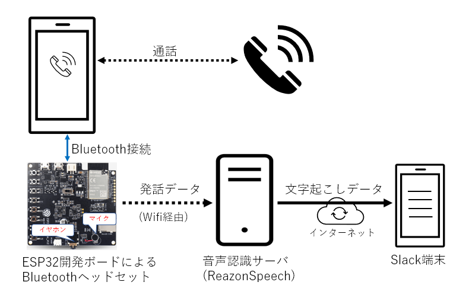
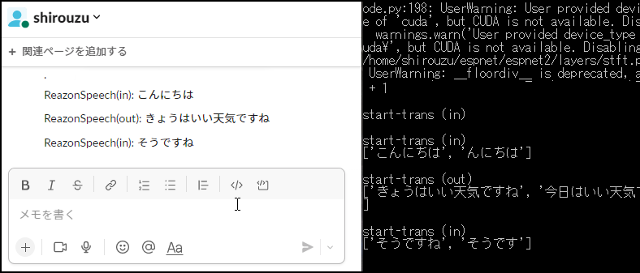

# (2023-01-15) スマホの通話内容をReazonSpeechで音声認識してSlackに転送する

## 概要
スマートフォンの通話内容を ReazonSpeechを使って音声認識させ、文字起こしした内容をSlackに転送する実験です。  

## 構成


上記のような構成で、スマートフォンの通話内容を Bluetoothヘッドセット（ESP32開発ボード）で受け取り、その発話データを音声認識サーバに送り込み、文字起こししたデータを WebHook経由でSlack端末に流す、という流れとなります。

## 開発の概要
1. ESP32開発ボード(ESP32-LyraT-mini)上で bluetooth/Wifモジュールを動作させ、発話データをキャプチャして音声認識サーバにUDP送信するコードを追加します。(C/C++)
1. 音声認識サーバ(ReazonSpeech)上で、発話データをUDP受信して ReazonSpeech を呼び出して文字起こしし、そのデータを Slack（WebHook経由）に渡すサーバを作ります。(Python)

## ESP32部分の開発
ESP32開発ボード開発元の espressif が提供している ESP32-ADF の pipeline_a2dp_sink_and_hfp をベースにします。  
https://github.com/espressif/esp-adf/tree/master/examples/get-started/pipeline_a2dp_sink_and_hfp  

これをビルドするだけで bluetoothヘッドセット(HFP)として、スマートフォン等からペアリングできるようになります。  
さらに ESP-IDF のサンプルコード群を参考にしつつ、ESP32用Wifi接続のための短いコードを書いて Wifi経由で TCP/IPを利用可能にします。([wifi.cpp](2023-01-15-ReazonSpeech-ESP32/pipeline_a2dp_sink_and_hfp/main/wifi.cpp))

## トラブル発生その１（ELFサイズ問題）

上記を一通り作ってビルドすると、サイズオーバーで Flash書き込みできない問題が発生します。
```
-- Build files have been written to: C:/src/esp-adf/examples/get-started/hfp2/build
[1/5] Generating ../../partition_table/partition-table.bin
Partition table binary generated. Contents:
*******************************************************************************
# ESP-IDF Partition Table
# Name, Type, SubType, Offset, Size, Flags
nvs,data,nvs,0x9000,24K,
phy_init,data,phy,0xf000,4K,
factory,app,factory,0x10000,0x13d620,
*******************************************************************************
[2/5] cmd.exe /C "cd /D C:\src\esp-adf\exampl...ted/hfp2/build/a2dp_sink_and_hfp_example.bin"
FAILED: esp-idf/esptool_py/CMakeFiles/app_check_size C:/src/esp-adf/examples/get-started/hfp2/build/esp-idf/esptool_py/CMakeFiles/app_check_size
cmd.exe /C "cd /D C:\src\esp-adf\examples\get-started\hfp2\build\esp-idf\esptool_py && C:\tools\Espressif\python_env\idf4.4_py3.8_env\Scripts\python.exe C:/tools/Espressif/frameworks/esp-idf-v4.4.3/components/partition_table/check_sizes.py --offset 0x8000 partition --type app C:/src/esp-adf/examples/get-started/hfp2/build/partition_table/partition-table.bin C:/src/esp-adf/examples/get-started/hfp2/build/a2dp_sink_and_hfp_example.bin"
Error: app partition is too small for binary a2dp_sink_and_hfp_example.bin size 0x18f720:
  - Part 'factory' 0/0 @ 0x10000 size 0x13d620 (overflow 0x52100)
```

これにはカスタム・パーテイションテーブル(partitions_bt_sink_example.csv)を作成して、factory/sizeフィールドを1300000 → 1800000に拡大することで、無事Flashできるようになりました。
```
# Espressif ESP32 Partition Table
#
# Note: if you change the phy_init or app partition offset
#       make sure to change the offset in Kconfig.projbuild
#
# Name,   Type, SubType, Offset,  Size, Flags
nvs,      data, nvs,     0x9000,  0x6000,
phy_init, data, phy,     0xf000,  0x1000,
factory,  app,  factory, 0x10000, 1800000,
```

## キャプチャ＆UDP送信モジュール作成
発話データをキャプチャした後、それを音声認識サーバにUDP送信するモジュールを書きます ([reazon_speech.cpp](2023-01-15-ReazonSpeech-ESP32/pipeline_a2dp_sink_and_hfp/main/reazon_speech.cpp))  
1. 語頭が切れるのを防ぐため、発話開始判定より少し遡ったデータを付与して送信
1. 音声パワーを計算して発話判定
1. 大きなデータはパケット分割して送信

などを行っています。

[a2dp_sink_and_hfp_example.c](2023-01-15-ReazonSpeech-ESP32/pipeline_a2dp_sink_and_hfp/main/a2dp_sink_and_hfp_example.c) の中にある bt_app_hf_client_outgoing_cb()/bt_app_hf_client_incoming_cb() に発話データがコールバックとして流れてくるので、ここに cloud_speech.cpp のキャプチャ用コールバックを挿入します。  
（なお、uint8_t *buf という I/F ですが、中身は 16bit little endian である点にご注意） 

```
static uint32_t bt_app_hf_client_outgoing_cb(uint8_t *p_buf, uint32_t sz)
{
    :
    if (is_get_hfp) {
        out_len_bytes = raw_stream_read(raw_read, enc_buffer, sz);

        cloud_speech_callback((uint8_t *)enc_buffer, out_len_bytes, 0); // <-- キャプチャコード追加
    }
    :
}

static void bt_app_hf_client_incoming_cb(const uint8_t *buf, uint32_t sz)
{
    cloud_speech_callback(buf, sz, 1); // <-- キャプチャコード追加
    :

}
```


## トラブル発生その２（メモリ問題）
これらを組み込んで起動すると今度はメモリ不足で起動直後に停止する問題が発生します。  
（そもそも、ESP32 にはメインメモリが512KB しかないため）  

LyraT の拡張RAM にメモリ確保を逃がす CONFIG設定を行うことで解決します。  
これで、ESP32側が完成し、動作するようになりました。

<details>
<summary>変更CONFIG一覧</summary>

```
CONFIG_BT_ALLOCATION_FROM_SPIRAM_FIRST=y
CONFIG_ESP32_SPIRAM_SUPPORT=y
CONFIG_SPIRAM_TYPE_AUTO=y
CONFIG_SPIRAM=y
CONFIG_SPIRAM_BOOT_INIT=y
CONFIG_SPIRAM_USE_MALLOC=y
CONFIG_SPIRAM_MEMTEST=y
CONFIG_SPIRAM_MALLOC_ALWAYSINTERNAL=131072
CONFIG_SPIRAM_TRY_ALLOCATE_WIFI_LWIP=y
CONFIG_SPIRAM_MALLOC_RESERVE_INTERNAL=32768
CONFIG_SPIRAM_ALLOW_BSS_SEG_EXTERNAL_MEMORY=y
CONFIG_SPIRAM_ALLOW_NOINIT_SEG_EXTERNAL_MEMORY=y
CONFIG_SPIRAM_CACHE_WORKAROUND=y
CONFIG_SPIRAM_CACHE_LIBJMP_IN_IRAM=y
CONFIG_SPIRAM_CACHE_LIBMATH_IN_IRAM=y
CONFIG_SPIRAM_CACHE_LIBNUMPARSER_IN_IRAM=y
CONFIG_SPIRAM_CACHE_LIBIO_IN_IRAM=y
CONFIG_SPIRAM_CACHE_LIBTIME_IN_IRAM=y
CONFIG_SPIRAM_CACHE_LIBCHAR_IN_IRAM=y
CONFIG_SPIRAM_CACHE_LIBMEM_IN_IRAM=y
CONFIG_SPIRAM_CACHE_LIBSTR_IN_IRAM=y
CONFIG_SPIRAM_CACHE_LIBRAND_IN_IRAM=y
CONFIG_SPIRAM_CACHE_LIBENV_IN_IRAM=y
CONFIG_SPIRAM_CACHE_LIBFILE_IN_IRAM=y
CONFIG_SPIRAM_CACHE_LIBMISC_IN_IRAM=y
CONFIG_SPIRAM_SUPPORT=y
CONFIG_WIFI_LWIP_ALLOCATION_FROM_SPIRAM_FIRST=y
```
</details>

## 音声認識サーバ (ReazonSpeech)
ESP32から送られてくる発話データ(UDP)を受信、ReazonSpeech を呼び出して文字起こしし、そのデータを Slack（WebHook経由）に渡すサーバを書きます。([2023-01-15-ReazonSpeech-ESP32/trans.py](trans.py))

わずか数十行で、音声認識＆WebHookが可能となりました。  
なお slack の WebHook用URLを取得して設定しておく必要があります。  
https://api.slack.com/messaging/webhooks

（ReazonSpeechのセットアップは[こちら](https://research.reazon.jp/projects/ReazonSpeech/quickstart.html)）

## トラブル発生その３（音が歪む）
実際に通話してみると文字認識できるものの、音声が酷く歪むことに気付きました。  
「こんにちは」と発音している例（昔のロボット映画みたいな音声）  

{download}`サンプル音声 <2023-01-15-ReazonSpeech-ESP32/yugami.wav>`  
<audio controls src="/_downloads\3ca69532dd5b6fca108c04f895b56001/yugami.wav"></audio>

不思議なことにWifiをOFFにすると歪みません。  
つまり何らかの理由で Wifi/通信が音声系に悪影響を与えていることが予想されました。  

同様の事例で解決例が無いかを探しつつ、通信のTCP化、音声コールバックと送信ルーチンの別スレッド化、各モジュール(IPスタック/Bluetooth/Wifi等)のCPUアフィニティ分散＆コア毎CPU使用率監視、SPIRAMとRAMの住み分け、各種CONFIG変更（2,000項目以上あります）等を色々試しましたが、なかなか解決しません。  

半分諦めつつもさらに探したところ「ESP32 には 2.4GHz RFモジュールが一つしかなく、Bluetooth と Wifi で競合することがある」という<a href="https://esp32.com/viewtopic.php?t=6707&start=30" target="_blank">掲示板記事</a>を見つけました。  

そこで、Bluetooth と Wifi をハードウェアで切り替えるモード（衝突時は Bluetooth優先）にCONFIGを変更(CONFIG_SW_COEXIST=n)したところ、無事、音声の歪みが取れました。


## 動作確認＆完成
一通り完成したところで、下記のような手順で動作確認を行います。
1. ESP32開発ボードを起動して、スマートフォンとペアリングします。
2. 音声認識サーバ(trans.py)を起動します。
3. スマートフォンに電話をかけて、通話を始めます。
4. Slackに、通話内容が文字起こしされた文章が転送され始めます。

下記のように、動作することが確認できました。

## 実行画面
Slack受信とコンソール画面の様子


[Slackでの受信動画](2023-01-15-ReazonSpeech-ESP32/video.mp4)

備考: ReazonSpeech(in)=受話データ、ReazonSpeech(out)=発話データ


## 感想
ReazonSpeechとESP32開発ボードを使うと、比較的簡単に通話内容の文字起こしができることがわかりました。  
発話データに比べ、受話データは圧縮/伸長後の劣化データのため若干精度が落ちることがあります。


## さらなる発展
これを m5stack でも実現できると楽しそうです。ただし ESP32-ADF は m5stack は直接対応していません。  
ですが、m5core2 で ESP32-ADF を組み込むための基礎を作って下さっている方がいました。  
https://github.com/ropg/m5core2_adf  

これに加えて今回のサンプルの場合、下記の要件を追加できれば実現できそうです。

1. スピーカー出力のイヤホン化（ハウリング防止）
2. 外付けマイク装着（m5core2 は半二重マイク）＆それに対応した i2s等のCONFIG作成

挑戦した方がいましたら、是非ご連絡ください。


