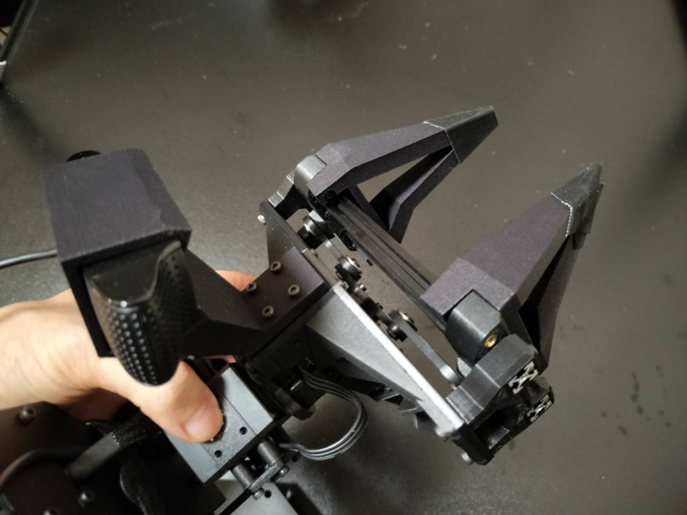
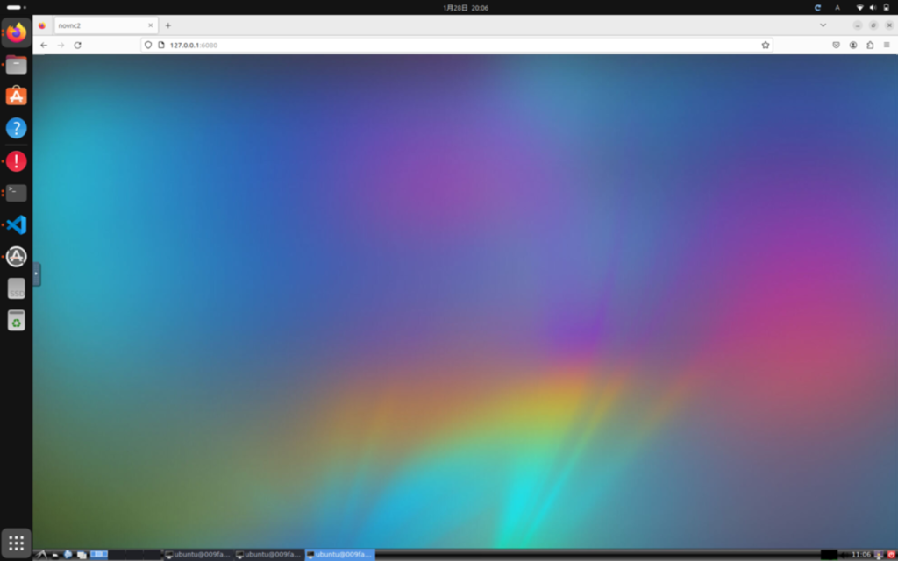

[//]: # (sphinx-build::html::head [<link rel="canonical" href="https://developers.agirobots.com/jp/how-to-run-aloha/" />])
[//]: # (sphinx-build::html::head [<meta name="robots" content="noindex, follow" />])

# (2024-03-02) ALOHAとACTを用いた模倣学習実験の再現方法

## はじめに

本記事では、RSS 2023で発表された論文「Learning Fine-Grained Bimanual
Manipulation with Low-Cost
Hardware」で紹介された、低コストのオープンソースハードウェア「ALOHA」を用いて、ACT（Action
Chunking with
Transformers）による模倣学習実験を行うまでの一連の作業について紹介します。

ALOHAとACTの論文:
<a href="https://arxiv.org/abs/2304.13705" target="_blank"
rel="noreferrer noopener">https://arxiv.org/abs/2304.13705</a>

ALOHAのGitHubリポジトリ:

<https://github.com/tonyzhaozh/aloha>

ACTのGitHubリポジトリ:

<https://github.com/tonyzhaozh/act>

ALOHAのセットアップについては、GitHubリポジトリに詳しい手順が記載されています。しかし、これらの手順は作業が多岐にわたりやや複雑で時間がかかります。また、ROSのNoetic環境が必要ですが、この記事の執筆時点で多くの方がUbuntu
22.04
LTS以上を使用しているだろうということを踏まえ、ホストPCのOSがNoeticに非対応のバージョンでも容易にセットアップできるようにDockerを利用した環境構築方法を作成しました。これにより、より手軽にALOHAの環境を整えることが可能です。

この記事は、私がレアゾン・ヒューマンインタラクション研究所（Reazon Human
Interaction
Laboratory）が主導するプロジェクトに参加するなかで得た知見に基づいています。  
ここでは、プロジェクトでの取り組みを公開し、その成果を共有することを目的としています。
この情報は、Reazon Human Interaction
LaboratoryのブログページとAGIRobotsのブログページの両方で同時に公開されています。  
**Reazon Human Interaction Laboratory**:
<a href="https://research.reazon.jp/index.html" target="_blank"
rel="noreferrer noopener">https://research.reazon.jp/index.html</a>  
**AGIRobots**:
<a href="https://developers.agirobots.com/jp/how-to-run-aloha/"
target="_blank"
rel="noreferrer noopener">https://developers.agirobots.com/jp/how-to-run-aloha/</a>

## 事前準備

### 要求されるPCの仕様

ALOHAでは、4台のアームロボット（ViperX 300とWidowX
250それぞれ2台ずつ）と4台のカメラ（Logitech
C922X）を使用します。これらの機器を同時に使用すると大量のUSB帯域を必要とするため、USB
3.0以上に対応したポートを2つ以上備えたPCが必要です。また、機械学習を行う場合は、**GPUを搭載したPC**、あるいは**外付けGPUの接続が可能なPC**を準備することをお勧めします。

### 要求されるOS

この記事で紹介する動作環境の整備ではDockerを使用しますので、Dockerが動作するOSが必要です。また、DockerコンテナからUSBデバイスへのアクセスが可能である必要がありますので、**基本的にはUbuntuを推奨**します。  
※Dockerのインストール方法については本記事では紹介していませんので、ご自身でインストールをお願いします。

## システム概要

本記事で構築するALOHAの動作環境の全体的な構成について説明します。以下の図を見てください。

> 

ALOHAは、左右のリーダーとフォロワーのアーム、カメラがそれぞれ2つのUSBハブを通じてPCに接続されます。これらのUSBハブは、PCのUSB
3.0以上のポートに接続されます（帯域が小さいと通信エラーになる可能性あり）。

デバイスをPCに接続すると、ロボットはttyUSB\*、カメラはvideo\*として認識されます（\*は任意の数字）が、この番号は接続の順番によって変化し、PCを再起動するたびに変化してしまう可能性があります。これでは不便ですので、/etc/udev/rules.dにデバイスIDから直接分かりやすい名前として認識するためのルールを記載し、各ロボットアームやカメラが毎回同じ名前で認識されるようにします。認識後の名前は上図の点線の輪で囲まれたようにします（次の章で説明）。

これが完了したら、本記事に記載のDockerfileをビルドし、Dockerイメージを作成します。作成されたDockerイメージからコンテナを作成すると、それはVNCを通じて操作可能で、ディスプレイがないマシンでもネットワークを介して別のPCからアクセスできます。同一マシン上からアクセスする場合は、ブラウザでhttp:127.0.0.1:6080にアクセスしましょう。

また、ACTで模倣学習するには事前に大量のエキスパートデータを用意しておく必要があります。そのエキスパートデータはホストPCに作成した\~/datasetsフォルダに保存することで、新しくコンテナを作成しなおしても収集したデータを再利用できるようにします。

※本記事で紹介するDockerfileはAMD64アーキテクチャ向けです。Raspberry
PiやJetsonなどで運用したい場合は、Dockerfileの内容を変更する必要があります。現時点では、これらのデバイス用のDockerfileは作成していませんが、将来的に追加する可能性があります。

以上が、本記事で構築するシステム概要となります。

## デバイス認識名の設定

ここでは、接続したデバイス名を、これから設定するファイル（**/etc/udev/rules.d/99-fixed-interbotix-udev.rules**）に記載の通りの名前として認識されるように設定を行います。今回接続するデバイスは、４台のアームロボットと４台のWebカメラです。それぞれについて、シリアル番号を確認する作業が、ここで一番の面倒なところです。

### ４台のアームロボットの認識名設定

USBで接続されたアームロボットは、ttyUSB\*の形で認識されますが、\*の部分は接続順によって変わります。これを解決するために、デバイスのシリアル番号を用いて、それぞれのアームロボットに固有の名前を割り当てます。

**各アームロボットのシリアル番号の取得**

まず、シリアル番号を調べるアームロボットのみをPCに接続します。そして、以下のコマンドを実行して、シリアル番号（例:
FT89FIZE）を取得します。  
※以下のコマンドでは、ttyUSB0としていますが、アームロボット以外のデバイスが接続されていると、必ずしもttyUSB0であるとは限りませんので、ロボットが接続されているデバイスがどれかを確認し、ttyUSBの番号を適宜変更したうえで実行しましょう。これを4台すべてのアームロボットについて実施します。シリアル番号は忘れないように、メモしておきましょう。

``` prism
udevadm info --name=/dev/ttyUSB0 --attribute-walk | grep serial
```

**udevルールの編集**

`/etc/udev/rules.d/99-fixed-interbotix-udev.rules`
を管理者権限のもとエディタで開き、以下のルールを追加します。

左側のリーダーアーム: `ttyDXL_master_left`  
右側のリーダーアーム: `ttyDXL_master_right`  
左側のフォロワーアーム: `ttyDXL_puppet_left`  
右側のフォロワーアーム: `ttyDXL_puppet_right`

例えば、左側のリーダアーム（ttyDXL_master_left）のシリアル番号がFT89FIZEのときは、以下のようにルールを記載します。  
これを残りのアームロボットについても実施します。その際は、ATTRS{serial}とSYMLINKの部分を適切に書き換えてください。4台のアームロボットについて設定が終わると4行分になります。

``` prism
SUBSYSTEM=="tty", ATTRS{serial}=="FT89FIZE", ENV{ID_MM_DEVICE_IGNORE}="1", ATTR{device/latency_timer}="1", SYMLINK+="ttyDXL_master_left"
```

**設定の確認**

99-fixed-interbotix-udev.rulesにルールを記載し終えたら、以下のコードを実行します。

``` prism
sudo udevadm control --reload && sudo udevadm trigger
```

そして、4台のアームロボットを接続し、指定した名前で認識されていることを確認して下さい。

### 4台のWebカメラの認識名設定

USBで接続されたWebカメラは、video\*の形で認識されますが、\*の部分は接続順によって変わります。これを解決するために、デバイスのシリアル番号を用いて、それぞれのWebカメラに固有の名前を割り当てます。

**各Webカメラのシリアル番号の取得**

まず、シリアル番号を知りたいWebカメラのみをPCに接続します。そして、以下のコマンドを実行して、シリアル番号を取得します。  
※以下のコマンドでは、video0としていますが、別のカメラが認識されていると、必ずしもvideo0であるとは限りませんので、カメラが接続されているデバイスがどれかを確認したうえで実行しましょう。

``` prism
udevadm info --name=/dev/video0 --attribute-walk | grep serial
```

>[!NOTE]
> 上記コマンドを実行しても、認識されない場合があります。
>
> Webカメラが正しく接続されているにもかかわらず、`Unknown device "/dev/video0": No such file or directory`が表示されていたら、正しく認識されていません。その場合は、`lsusb -vt`を実行し、ドライバーが読み込まれているかを確認してください。
>
> ALOHA付属のLogitech C922 Pro Stream
> WebcamのVideoのドライバー部分が、`Driver=,`と空白の場合、ドライバーうまく読み込まれていません。このWebカメラはUVCタイプなので、Linuxであればデフォルトで搭載されている`uvcvideo`で問題なく利用できるはずです。
>
> `dmesg`コマンドを用いて、デバイスの接続におけるログを確認しましょう。直近20個のログを確認する場合は`dmesg | tail -n 20`を使用します。もし、C922の接続で、`Lockdown: systemd-udevd: unsigned module loading is restricted; see man kernel_lockdown.7`というようなものが記載されていたら、ロックダウン機能が有効化されていることが原因です。これは、セキュアブートが有効化されていると、自動的に設定されてしまうことがあるので、`mokutil --sb-state`コマンドで確認し、もしセキュアブートが有効化されていたら、BIOS/UEFIを開いて、無効化してください。

**udevルールの編集**

アームロボットのデバイス名のルールを記載したファイルと同じ`/etc/udev/rules.d/99-fixed-interbotix-udev.rules`
をエディタで開き、以下のルールを追加します。

左側のフォロワーアームのカメラ: `CAM_LEFT_WRIST`  
右側のフォロワーアームのカメラ: `CAM_RIGHT_WRIST`  
真ん中付近下のカメラ: `CAM_LOW`  
真ん中付近上のカメラ: `CAM_HIGH`

ルールの例は以下の通りです。ATTRS{serial}とSYMLINKの部分を適切に書き換えてください。4台のカメラを接続するので、4行分のルールを追記してください。

``` prism
SUBSYSTEM=="video4linux", ATTRS{serial}=="<カメラのシリアル番号>", ATTR{index}=="0", ATTRS{idProduct}=="085c", ATTR{device/latency_timer}="1", SYMLINK+="CAM_LEFT_WRIST"
```

**設定の確認**

99-fixed-interbotix-udev.rulesにルールを記載し終えたら、以下のコードを実行します。

``` prism
sudo udevadm control --reload && sudo udevadm trigger
```

そして、4台のWebカメラを接続し、指定した名前で認識されていることを確認して下さい。

## グリッパーにトルク制限を設定

Dynamixel
Wizardを使用し、フォロワー側のアームのIDが9番のサーボに電流制限を追加し、グリッパが過度に強く閉じて壊れることや、過負荷エラーを防げるようにします。具体的にはアドレス38のCurrent
Limitを300に設定します。

> 

## Dockerイメージのビルド

この章では、ALOHAの制御およびACTによる模倣学習を行うためのDockerイメージを作成します。

DockerイメージをビルドするにはDockerfileが必要です。aloha_dockerというフォルダをホームディレクトリ直下に作成し、その中にDockerfileを作成することにします。

``` prism
mkdir ~/aloha_docker
```

aloha_dockerフォルダの中で、Dockerfileを作成します。

``` prism
nano ~/aloha_docker/Dockerfile
```

Dockerfileには下記のコードを記載します。

``` prism
FROM tiryoh/ros-desktop-vnc:noetic

# ROOTにNoeticの環境をインストールする
RUN /tmp/ros_setup_scripts_ubuntu/ros-noetic-desktop.sh

# 必要な依存関係のインストール
RUN apt-get update && apt-get install -y \
    curl \
    git \
    python3-pip \
    ros-noetic-usb-cam \
    ros-noetic-cv-bridge \
    sudo \
    vim \
    expect \
    && rm -rf /var/lib/apt/lists/*

# キーボード設定を事前に設定
RUN echo 'keyboard-configuration keyboard-configuration/layout select English (US)' | debconf-set-selections
RUN echo 'keyboard-configuration keyboard-configuration/layoutcode select "us"' | debconf-set-selections

# XSArmの制御用の各種機能をダウンロード＆インストール
RUN curl 'https://raw.githubusercontent.com/Interbotix/interbotix_ros_manipulators/main/interbotix_ros_xsarms/install/amd64/xsarm_amd64_install.sh' > xsarm_amd64_install.sh && \
    chmod +x xsarm_amd64_install.sh && \
    ./xsarm_amd64_install.sh -d noetic -n -p /root/interbotix_ws

# ALOHAのリポジトリをクローン
RUN cd /root/interbotix_ws/src && git clone https://github.com/tonyzhaozh/aloha.git

# ワークスペースのビルド
RUN /bin/bash -c '. /opt/ros/noetic/setup.sh; /root/interbotix_ws/devel/setup.sh; cd /root/interbotix_ws; catkin_make'

# interbotix_xs_toolboxのarm.pyファイルを編集
RUN sed -i '/self.T_sb = mr.FKinSpace(self.robot_des.M, self.robot_des.Slist, self.joint_commands)/c\        self.T_sb = None' /root/interbotix_ws/src/interbotix_ros_toolboxes/interbotix_xs_toolbox/interbotix_xs_modules/src/interbotix_xs_modules/arm.py

# ROS環境とinterbotix_wsのsetup.shをsourceするためのコマンドを.bashrcに追加
RUN echo "source /opt/ros/noetic/setup.sh" >> /root/.bashrc && \
    echo "source /root/interbotix_ws/devel/setup.sh" >> /root/.bashrc

ENV USER root

RUN mkdir /datasets  # エピソードのデータを保存するためのフォルダ。ホストPC上のディレクトリをマウントする用
# sedコマンドを使用してDATA_DIRを上で作成した/datasetsに変更
RUN sed -i "s|DATA_DIR = '<put your data dir here>'|DATA_DIR = '/datasets'|" "/root/interbotix_ws/src/aloha/aloha_scripts/constants.py"

RUN git clone https://github.com/tonyzhaozh/act.git  # ACT


# Pythonパッケージのインストール
RUN pip3 install torch torchvision pyquaternion pyyaml rospkg pexpect mujoco dm_control opencv-python matplotlib einops packaging h5py ipython
```

このDockerfileをビルドする際には、以下のコードを使用しましょう。以下のコードでは、作成されるイメージにros-noetic-vnc-alohaというタグを付与しています。

``` prism
docker build -t ros-noetic-vnc-aloha ~/aloha_docker
```

## Dockerコンテナの起動

先ほどビルドしたDockerイメージからコンテナを作成します。これは、docker
runコマンドで行います。その際に、ルートディレクトリに\~/aloha/datasetsフォルダを作成し、コンテナにマウントします。先ほど軽く触れましたが、収集したエキスパートデータは全てこの\~/aloha/datasetsフォルダの中に保存されます。まだこのフォルダを作成していないと思いますので、以下のコマンドを実行して、ホストPCに\~/aloha/datasetsフォルダを作成してください。

``` prism
mkdir -p ~/aloha/datasets
```

以下のコマンドを実行して、コンテナを起動しましょう。

``` prism
docker run -it -p 6080:80 --privileged --gpus all --volume ~/aloha/datasets:/datasets --volume /dev:/dev --shm-size=512m ros-noetic-vnc-aloha
```

ブラウザからhttp://127.0.0.1:6080にアクセスし、無事、下図のようなリモートデスクトップが起動すれば問題ありません。



## リーダーフォロワーによる操作実験

では、まずはリーダーフォロワーによる操作を試してみましょう。ALOHAがPCに接続されていることを確認したうえで、以下の図のように3つのターミナルを開いて下さい。


そして、それぞれのターミナルに以下を入力してください。

``` prism
# 1つ目のターミナル
source /opt/ros/noetic/setup.sh && source ~/interbotix_ws/devel/setup.sh
roslaunch aloha 4arms_teleop.launch

# 2つ目のターミナル
cd ~/interbotix_ws/src/aloha/aloha_scripts
python3 one_side_teleop.py right

# 3つ目のターミナル
cd ~/interbotix_ws/src/aloha/aloha_scripts
python3 one_side_teleop.py left
```

すると、リーダーアームとフォロワーアームが自動で持ち上がります。リーダーアームのグリッパーを閉じると操作を開始できます。

以下のXに投稿された動画は、テレオペレーションを実施している様子です。

> レアゾンHI研では、音声情報や画像情報に加えてロボット制御情報を含めたマルチモーダルデータを的確に処理できる基盤モデルを研究開発し、  
> 高度かつ自然なヒューマンインタラクション技術の実現を目指しています。  
> このテーマを一緒に探求する研究員やパートナー企業を募集しています!  
> DM開放してます [pic.twitter.com/TZUn1GIBdR](https://t.co/TZUn1GIBdR)
>
> — REAZON ヒューマンインタラクション研究所 (@REAZON_HI_Lab) [February
> 15,
> 2024](https://twitter.com/REAZON_HI_Lab/status/1758031208578179580?ref_src=twsrc%5Etfw)

※本来、ALOHAの実験機は、リーダーアームの各関節を上部からゴムで吊るすのですが、ここでは便宜上、上部から吊るしていません。

## エキスパートデータの収集方法

リーダーフォロワーによる制御が確認できたら、次はACTで模倣学習をするための準備として、エキスパートデータを収集してみましょう。

### constants.pyにタスクの種類を記載

エキスパートデータを収集する前に、これから収集するデータのタスク内容について、alohaリポジトリの中にあるconstants.pyに追記する必要があります。デフォルトだと以下のように、aloha_wear_shoeのみが記載されています。

``` wp-block-code
TASK_CONFIGS = {
    'aloha_wear_shoe':{
        'dataset_dir': DATA_DIR + '/aloha_wear_shoe',
        'num_episodes': 50,
        'episode_len': 1000,
        'camera_names': ['cam_high', 'cam_low', 'cam_left_wrist', 'cam_right_wrist']
    },
}
```

ここに、収集したいデータのタスクについての情報を追加します。（あまり良い例ではないですが）例えば、動作テスト（operation_test）なら、以下のようにして既存のタスクセットに追加することが考えられます。

``` wp-block-code
TASK_CONFIGS = {
    'aloha_wear_shoe':{
        'dataset_dir': DATA_DIR + '/aloha_wear_shoe',
        'num_episodes': 50,
        'episode_len': 1000,
        'camera_names': ['cam_high', 'cam_low', 'cam_left_wrist', 'cam_right_wrist']
    },
    'operation_test':{
        'dataset_dir': DATA_DIR + '/operation_test',
        'num_episodes': 50,
        'episode_len': 1000,
        'camera_names': ['cam_high', 'cam_low', 'cam_left_wrist', 'cam_right_wrist']
    },
}
```

### エキスパートデータの収集

データの収集はrecord_episoeds.pyを実行することで行います。その際には、タスクの名前と、エピソードの番号を指定します。以下は、先程constants.pyに定義したoperation_testタスクにおけるエピソード0番目の収集を行う場合の例です。

``` prism
python3 record_episodes.py --task_name operation_test --episode_idx 0
```

### 収集したエピソードデータからWebカメラの映像を生成

Webカメラから収集された映像が学習に適しているかを確認してみましょう。引数のdataset_dirは省略できないのがちょっと面倒ですが、以下のようなコマンドを実行してください。

``` prism
python3 visualize_episodes.py --dataset_dir /datasets/operation_test --episode_idx 0
```

これを実行すると、このエピソードの実行時に撮影された４つのカメラからの映像が１つの映像にまとめられてファイルとして出力されます。左から順番に、トップビュー、左側アームからのビュー、ボトムビュー、右側アームからのビューです。

一番左側の映像に注目していただきたいのですが、アームが映っていません。つまり、Webカメラの角度が適切でないことが確認できます。このような場合は、**上に設置したWebカメラの角度を調節し、フォロワーのアームロボットが正しく映るように**してください。

### 動作の再生

以下を実行すると、収集した動作が実機で再生されます。

``` prism
python3 replay_episodes.py --dataset_dir /datasets/operation_test --episode_idx 0
```

## ACTによる模倣学習

コンテナ内でターミナルを開き、`nvidia-smi`を実行し、GPUが使用できるか確認しましょう。問題なく実行できるのであれば、以下のようにGPUの情報が表示されます。

> 

### 十分なエキスパートデータの収集

先ほど、エキスパートデータの収集方法について記載しました。ACTで模倣学習し、高い精度をで動作を獲得するには、それなりに沢山のエキスパートデータが必要になりますので、適宜収集してください。

本記事では、エラーが無く学習できるところまでを確認することが目的ですので、箱からサーボを取り出す動作を10エピソードだけ収集してみました。

### 模倣学習の実行

模倣学習をするには以下のコードを実行します。

\<ckpt dir\>には学習済みモデルを保存するディレクトリを指定します。

``` prism
cd ~/act
python3 imitate_episodes.py \
--task_name operation_test \
--ckpt_dir <ckpt dir> \
--policy_class ACT --kl_weight 10 --chunk_size 100 --hidden_dim 512 --batch_size 8 --dim_feedforward 3200 \
--num_epochs 2000  --lr 1e-5 \
--seed 0
```

### 学習後のモデルによる実機の動作

エラーが無く学習を終了できたら、実機で動作を再現してみましょう。

再現するときは、先ほど模倣学習を行った時に実行したimitate_episodes.pyの引数に、--evalを追加するだけです。

``` prism
cd ~/act
python3 imitate_episodes.py \
--task_name operation_test \
--ckpt_dir <ckpt dir> \
--policy_class ACT --kl_weight 10 --chunk_size 100 --hidden_dim 512 --batch_size 8 --dim_feedforward 3200 \
--num_epochs 2000  --lr 1e-5 \
--seed 0 \
--eval
```

収集したエキスパートデータの質が高くなく、量が少ないので、動作は変な感じですね（笑）。それと、アームが激しく振動しているのでカメラが揺れてます（笑）。

[www.youtube.com](https://www.youtube.com/watch?v=OopJM3L8no8)

今後、別のタスクで、膨大なエキスパートデータを収集し、模倣学習実験を行う予定なので、良い動作が実現できたら追記したいと思います。

## さいごに

本記事では、ALOHAとACTを用いた模倣学習実験の再現方法について説明しました。エラー無く最後まで実行できましたでしょうか？

本記事執筆時点では、まだ動作の再現ができただけで、技術の本質的な部分にふれられていないので、より深い部分にたどり着けるよう、実験を行っていきたいと思います。

最後までお読みいただきありがとうございました。

Copyright © 2024 [AGIRobots Blog](https://developers.agirobots.com/jp)
All Rights Reserved.
