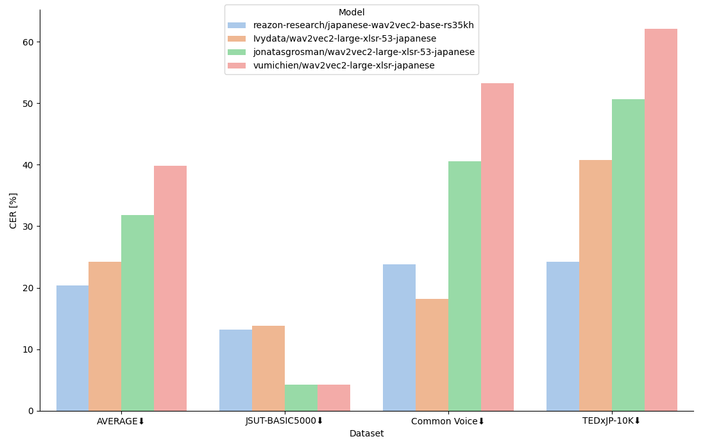

# (2024-10-21) 大規模日本語音声による事前学習モデルWav2Vec2を公開

35,000時間の大規模日本語音声コーパスReazonSpeech v2.0を用いて事前学習及びファインチューニングを行ったWav2Vec2 [^1] を公開しました！

本記事では、公開したモデルのベンチマーク結果と、Transformersライブラリを用いたWav2Vec2の事前学習の方法を紹介します。

今回公開したモデルは、以下の2つのWav2Vec2 Baseモデルです。

- [`reazon-research/japanese-wav2vec2-base`](https://huggingface.co/reazon-research/japanese-wav2vec2-base)
   - ReazonSpeech v2.0コーパスを用いて事前学習を行ったモデル
- [`reazon-research/japanese-wav2vec2-base-rs35kh`](https://huggingface.co/reazon-research/japanese-wav2vec2-base-rs35kh)
   - `reazon-research/japanese-wav2vec2-base`をReazonSpeech v2.0コーパスを用いてCTCファインチューニングを行ったモデル

## ベンチマーク結果

ここでは、CTCファインチューニングを行った`reazon-research/japanese-wav2vec2-base-rs35kh`とその他Wav2Vec2ファミリーのCTCモデルを用いて、日本語音声の書き起こし性能のベンチマークを行います。  
`japanese-wav2vec2-base-rs35kh`の学習データとして用いていない、JSUT-BASIC5000 [^2]、Common Voice [^3]、TEDxJP-10K [^4] の3つのデータセットを用いて性能を検証します。
評価指標には、CER (Character Error Rate)を用います。

ベンチマークに使用したモデルと学習データは以下の表の通りです。
モデルは全てHugging Face上に公開されています。

| モデル名                                         | 事前学習モデル                           |        学習データ         |
| :----------------------------------------------- | :--------------------------------------- | :-----------------------: |
| `reazon-research/japanese-wav2vec2-base-rs35kh`  | `reazon-research/japanese-wav2vec2-base` |     ReazonSpeech v2.0     |
| `Ivydata/wav2vec2-large-xlsr-53-japanese`        | `facebook/wav2vec2-large-xlsr-53`        |  Common Voice, JVS, JSUT  |
| `jonatasgrosman/wav2vec2-large-xlsr-53-japanese` | `facebook/wav2vec2-large-xlsr-53`        | Common Voice, CSS10, JSUT |
| `vumichien/wav2vec2-large-xlsr-japanese`         | `facebook/wav2vec2-large-xlsr-53`        |    Common Voice, JSUT     |

※ XLSR [^5] とは、53言語の音声データを用いて、Wav2Vec2.0の学習フレームワークにより事前学習を行ったモデルです。



上図はベンチマーク結果を示しており、AVERAGEは3つのデータセットでのCERの平均値です。

結果から、`japanese-wav2vec2-base-rs35kh`はAVERAGEで最もCERが低く、良い性能を示しています。

しかし、JSUT-BASIC5000やCommon Voiceでは、他モデルの方が非常に良い性能を示す場合があります。
他モデルは学習データにJSUT-BASIC5000やCommon Voiceを用いているため、テストデータとして用いたデータが学習データに含まれている可能性が考えられます。

ベンチマークに使用した全てのテストデータは`japanese-wav2vec2-base-rs35kh`の学習データに含まれていないが、AVERAGEでは最も良い性能を示しており、十分な性能が得られているのではないでしょうか。


試しに長時間音声が含まれるJSUT-Bookコーパスでベンチマークを行うと、上図のような結果になりました。

長時間音声に対しては、`japanese-wav2vec2-base-rs35kh`はもっとも悪い性能となっています。

学習に用いたReazonSpeech v2.0コーパスには、数分単位の長時間音声が含まれないため、長時間音声を一気に処理するには向いていないようです。  

長時間音声に対応するためには、短い音声セグメントに区切ってから処理したり、長時間音声用にファインチューニングするなどの工夫が必要そうです。

<details>
<summary>評価コード参考</summary>

以下のコードは推論とCERの計算を行うサンプルコードです。

※ `vumichien/wav2vec2-large-xlsr-japanese`の推論結果には、トークン間に空白が入ってしまうため、
モデルの推論結果から空白を除くよう処理を加えました。  
(例: 今 流行 の 単身 赴任 族 の 淋し さ を ちょっぴり 味ごば せ て もらっ た の も 有 意義 の 体験 だ)

```python
import re
import num2words
import editdistance
import librosa
import numpy as np
import torch
from transformers import AutoProcessor, Wav2Vec2ForCTC

PUNCTUATIONS = {ord(x): "" for x in "、。「」『』，,？！!!?!?"}
ZENKAKU = "ａｂｃｄｅｆｇｈｉｊｋｌｍｎｏｐｑｒｓｔｕｖｗｘｙｚＡＢＣＤＥＦＧＨＩＪＫＬＭＮＯＰＱＲＳＴＵＶＷＸＹＺ０１２３４５６７８９"
HANKAKU = "abcdefghijklmnopqrstuvwxyzABCDEFGHIJKLMNOPQRSTUVWXYZ0123456789"
ZEN2HAN = str.maketrans(ZENKAKU, HANKAKU)


def normalize(s):
    s = s.translate(PUNCTUATIONS).translate(ZEN2HAN)
    conv = lambda m: num2words.num2words(m.group(0), lang='ja')
    return re.sub(r'\d+\.?\d*', conv, s)


model = Wav2Vec2ForCTC.from_pretrained(model_path).to("cuda")
processor = AutoProcessor.from_pretrained(model_path)

audio, _ = librosa.load(audio_filepath)
audio = np.pad(audio, pad_width=int(0.5 * 16_000))
input_values = processor(
    audio,
    return_tensors="pt",
    sampling_rate=16_000
).input_values.to("cuda")

with torch.inference_mode():
    logits = model(input_values).logits.cpu()
predicted_ids = torch.argmax(logits, dim=-1)[0]
transcription = processor.decode(predicted_ids, skip_special_tokens=True)
asr = normalize(transcription.replace(" ", ""))
text = normalize(text)
dist = editdistance.eval(asr, text)
cer = dist / len(text)
```
</details>

## Wav2Vec2をTransformersライブラリ基盤で事前学習するには？

Wav2Vec2をTransformersライブラリ基盤の上で事前学習するには、少しだけコツが必要です。

まず、`Transformers.Trainer`を用いて学習するためには、モデルが持つ`forward`メソッドの引数に`labels`、出力に`loss`を持つ必要があります。  
**たとえ、`labels`を与える必要がなくても、必須です。**  
Transformersに用意されているWav2Vec2の事前学習用モデルクラスの`Wav2Vec2ForPreTraining`には、`labels`を引数を取ることができません。  
Wav2Vec2は自己教師あり学習フレームワークに基づいて学習されており、**外部から正解ラベルを与える必要がないため**、このクラスの設計になっているのだと思います。

そのため、以下のように、ダミーとして`labels`を引数に取ることができるモデルクラスでラップすることで、`Transformers.Trainer`を用いて簡単に学習することができます。

```python
from transformers import Wav2Vec2ForPreTraining


class Wav2Vec2ForPreTrainingWrapper(Wav2Vec2ForPreTraining):
    def __init__(self, config):
        super().__init__(config=config)

    def forward(
        self,
        input_values,
        attention_mask=None,
        output_attentions=None,
        output_hidden_states=None,
        return_dict=None,
        mask_time_indices=None,
        sampled_negative_indices=None,
        labels=None,  # labelsをダミーで設定
    ):
        outputs = super().forward(
            input_values=input_values,
            attention_mask=attention_mask,
            output_attentions=output_attentions,
            output_hidden_states=output_hidden_states,
            return_dict=return_dict,
            mask_time_indices=mask_time_indices,
            sampled_negative_indices=sampled_negative_indices,
        )  # もちろんlabelsは使うことはない
        return outputs
```

## おわりに

今回、35,000時間の大規模日本語音声コーパスReazonSpeech v2.0を用いて事前学習およびファインチューニングを行ったWav2Vec2を公開しました。  

Apache 2.0ライセンスにて公開するため、ぜひ学術研究等で広くご活用ください！

また、ファインチューニングデータを揃えたベンチマークなどによる詳細なモデル評価や、別データで継続学習を行った派生モデルの開発などのフィードバックも、広くお待ちしております！

---

[^1]: Baevski, A., Zhou, Y., Mohamed, A. and Auli, M., 2020. wav2vec 2.0: A framework for self-supervised learning of speech representations. Advances in neural information processing systems, 33, pp.12449-12460.  
[^2]: [https://sites.google.com/site/shinnosuketakamichi/publication/jsut](https://sites.google.com/site/shinnosuketakamichi/publication/jsut)  
[^3]: [https://commonvoice.mozilla.org/](https://commonvoice.mozilla.org/)  
[^4]: [https://github.com/laboroai/TEDxJP-10K](https://github.com/laboroai/TEDxJP-10K)  
[^5]: Conneau, A., Baevski, A., Collobert, R., Mohamed, A. and Auli, M., 2020. Unsupervised cross-lingual representation learning for speech recognition. arXiv preprint arXiv:2006.13979.
